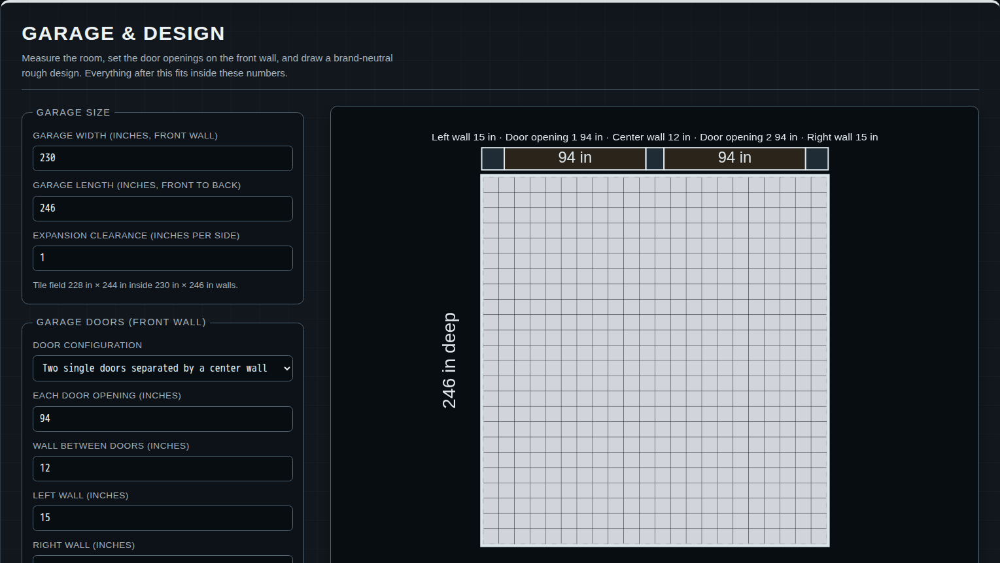
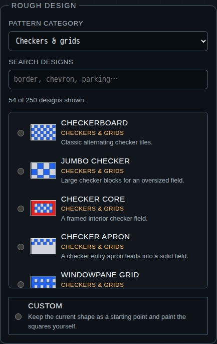
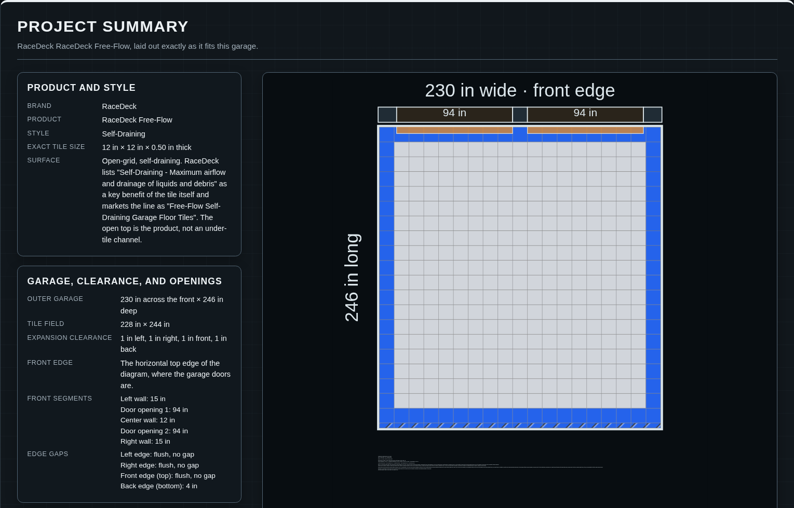

[](docs/assets/garagedesign-logo.svg)

# Design it. Price it. Build with confidence.

Garage Design turns an empty garage into a floor plan you can actually buy. Enter the room and door
measurements, explore hundreds of layouts, compare real drainable tile products, and see the cuts,
packages, ramps, leftovers, and estimated cost before ordering.

<p align="center">
  
</p>

## Go from a rough idea to a purchase plan

- **See the finished floor.** Model the garage walls and door openings, then preview the tile field
  at the room's real proportions.
- **Find a look that fits.** Start from 250 original borders, checkerboards, parking bays, stripes,
  racing patterns, and showroom designs.
- **Make it yours.** Change the palette or paint individual squares by clicking, dragging, touching,
  or using the keyboard.
- **Compare products honestly.** Map the design to verified drainable tiles and the colors each
  product actually offers.
- **Know what to order.** Calculate whole tiles, cuts, waste, boxes, individual tiles, ramps,
  leftovers, Illinois tax, and known shipping rules.

| Explore 250 layouts                                                                                                | Turn the design into an order estimate                                                                                                          |
| ------------------------------------------------------------------------------------------------------------------ | ----------------------------------------------------------------------------------------------------------------------------------------------- |
|  |  |

## Built around the decisions that cost money

Garage Design does more than divide square footage by tile size. Full tiles begin at the front and
right edges of the usable tile field, keeping cuts away from the garage doors. The estimate follows
the package sizes sellers publish, plans transition ramps for each opening, separates known costs
from unknown shipping, and shows what will be left after installation.

Compare verified open-grid products from Swisstrax, RaceDeck, VEVOR, ModuTile, Greatmats,
FlooringInc, and TrueLock. Save promising plans in the browser, download the exact floor drawing,
or open a print-ready project report when it is time to review the order.

## Run with Docker

Garage Design is intentionally container-only. Node, npm dependencies, and browser-test tooling
stay inside Docker. The project directory is mounted for source editing, while `node_modules` is
stored in a Docker named volume instead of on the host.

Prerequisite: Docker Engine or Docker Desktop with Docker Compose v2.

```sh
docker compose build toolchain
docker compose run --rm toolchain npm ci
docker compose up dev
```

Open <http://localhost:5173>.

Stop the application with:

```sh
docker compose down
```

To remove the dependency volume as well:

```sh
docker compose down --volumes
```

This deletes the installed dependencies. Run
`docker compose run --rm toolchain npm ci` before starting the app again.

## Product and pricing notes

Catalog facts are point-in-time observations from linked manufacturer and retailer pages. Prices
are estimates, not quotes. Garage Design uses the Illinois state sales-tax rate of 6.25% for
planning and applies a shipping charge only when a seller publishes a rule the catalog can verify.
An unknown shipping charge keeps the estimated checkout total unavailable.

After expansion clearance is removed, full tiles begin at the front edge of the usable tile field
and finish at its right edge. Any required cut strips are placed along the back and left edges of
that field. Confirm current price, stock, color availability, ramp compatibility, tax treatment,
and final shipping with the seller before ordering.

Garage Design is independent and is not affiliated with or endorsed by any flooring manufacturer
or retailer. Product names and trademarks are used only to identify compared products.

## Documentation

- [Documentation index](docs/README.md)
- [Contributing and Docker workflow](CONTRIBUTING.md)

## Privacy and browser support

There are no accounts, analytics, backend services, or cloud synchronization. Saved plans remain
in browser storage on the current device. Clearing site data removes them.

Remote product photos are requested directly from their attributed source hosts and are never
included in exports. The interface supports desktop layouts from approximately 1024 to 1920 pixels
wide, keyboard navigation, visible focus states, reduced motion, and non-color tile symbols.

## Current limits

Garage Design handles rectangular garages with configurable openings along the front wall. It does
not model cabinets, lifts, drains, columns, stairs, recesses, irregular rooms, installation labor,
live inventory, or retailer checkout. Shipping remains unknown unless a published rule can be
verified for the selected product and order.

## License

Garage Design is available under the [MIT License](LICENSE).
